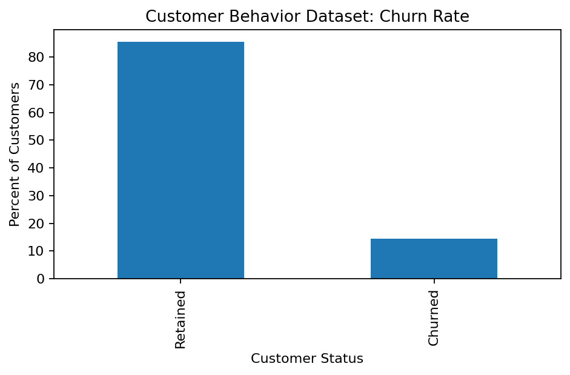
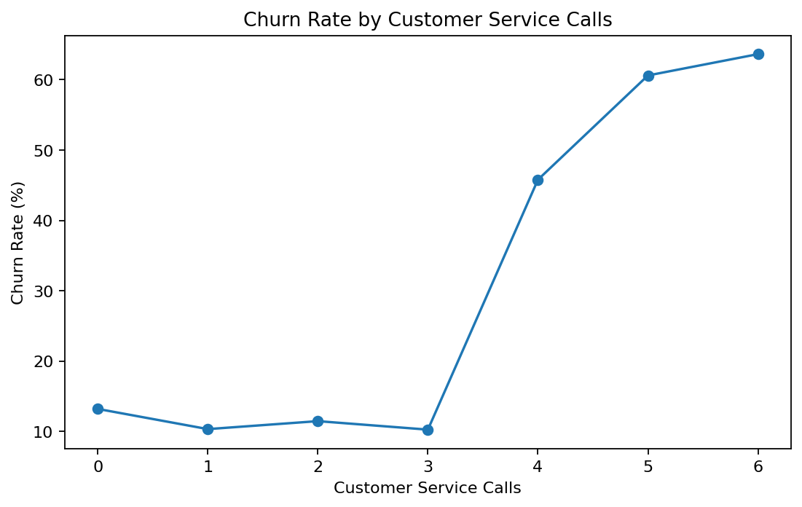
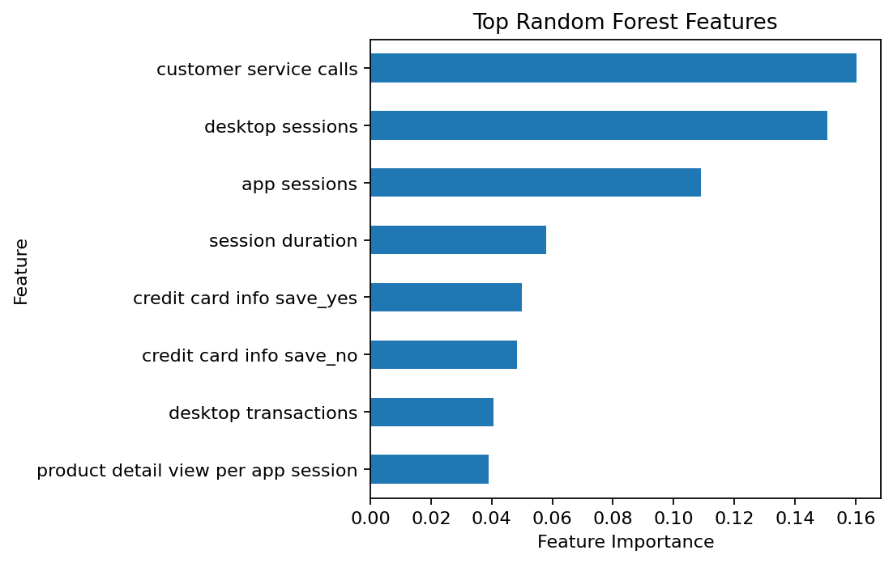

# E-Commerce Customer Behavior Analysis

Python • EDA • Churn Prediction • Behavioral Analytics



## Project overview

This project explores e-commerce customer behavior and uses behavioral features to investigate churn. The analysis
covers data-type correction, exploratory data analysis, behavioral comparisons, and a Random Forest classification model.

## Dataset

- **3,333 customer records**
- **20 columns**
- Features include account length, desktop/app sessions, transactions, product views, order value, discounts,
  cart activity, promotion clicks, customer-service calls, and churn.

The raw dataset is not redistributed in this GitHub-ready package because the original source/license was not preserved.
See [`data/README.md`](data/README.md).

## Data preparation

Several numeric fields were stored using decimal commas and required conversion before analysis:

- Average order value
- Discount rate per visited products
- Product detail views per app session
- Add to cart per session

The malformed churn field was also parsed into a clean binary target.

## Key findings

- Overall churn rate: **14.5%**.
- Churn increases sharply when customer-service calls become frequent; customers with **4 calls** had a churn rate
  of approximately **45.8%** in this dataset.
- In the refreshed Random Forest model, **customer service calls, desktop sessions, and app sessions** were among the
  strongest predictive features.
- The refreshed model achieved **93.3% test accuracy** and a **0.73 F1-score for the churn class**.





## Repository structure

```text
03_ecommerce_customer_behavior/
├── README.md
├── requirements.txt
├── data/
│   └── README.md
├── images/
│   ├── churn_rate.png
│   ├── churn_by_service_calls.png
│   └── feature_importance.png
└── notebooks/
    └── customer_behavior_analysis.ipynb
```

## Skills demonstrated

- Python / pandas
- Data-type correction
- Exploratory data analysis
- Behavioral analytics
- Churn analysis
- Random Forest classification
- Feature importance
- Data visualization
- Business interpretation
